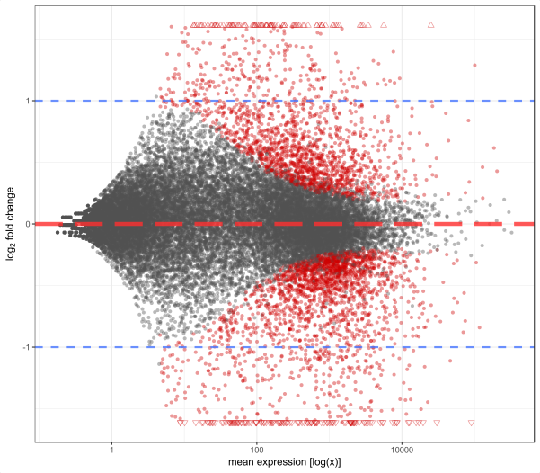
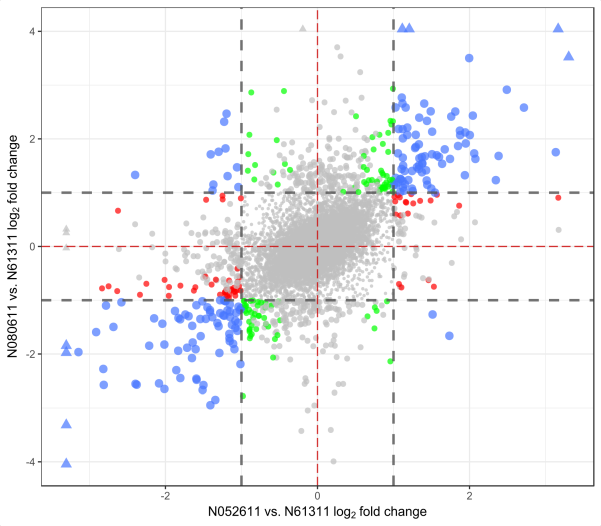

# ggDESeq

Overview
--------

The aim of `ggDESeq` is to make rapid visualizations of commonly used RNA seq plots derived from `DESeq` data sets a possibility. By implementing the aesthetic qualities of `ggplot2`, we are able to generate publication-worthy graphics. You need to provide the `DESeq`-related data frame with subsequent experimental conditions, and it takes care of the graphics and condtional statements.

Installation
------------

The easiest way to obtain this package is to install `devtools` and pull the package contents directly from GitHub.

``` r
# Development version from GitHub
# install.packages('devtools')

devtools::install.github('btmonier/ggDESeq')
```

Dependencies
------------

Since this package assumes that you have prior knowledge with RNA seq experimentation and `DESeq2`, it is mandatory that you not only have `DESeq2` already installed in your `R` environment, but also `ggplot2` for aesthetic rendering. `DESeq2` can be found on Bioconductor. For further information on `DESeq2` and Bioconductor in general, please visit the following [website](http://bioconductor.org/packages/release/bioc/html/DESeq2.html).


Usage
-----

Since this package is currently in its 'infantile' stage, It contains only three visualization schemes:
* `ggMA()`
* `ggVolcano()`
* `ggFourWay()`


#### `ggMA()`

`ggMA()` will generate an MA plot. This plot visualizes the variance between two samples in terms of gene expression values where logarithmic fold changes of count data are plotted against mean counts. In order to visualize this from a `DESeq` object class, the function extracts the necessary data by exploiting `DESeq2`'s `results()` function and placing it into a temporary data frame. Data points that meet the user defined adjusted p-value parameters will be highlighted in red. Data points that have 'extreme' values (i.e. substantially large log fold changes) will change shape characteristics.

``` r
library(ggDESeq)

ggMA(data = dds, padj = 0.05)
```



#### `ggVolcano()`

`ggVolcano()` will generate a volcano plot. This plot visualizes the variance between two samples in terms of gene expression values where the negative log of calculated p-values (y-axis) are a plotted against the log fold changes (x-axis). Similar to `ggMA()`, a `DESeq` object class is required in which the necessary data is extracted using the `result()` function from `DESeq2`. Data points that meet the user defined adjusted p-value parameters will be highlighted in red. Data points that have 'extreme' values (i.e. substantially large log fold changes) will change shape characteristics.

``` r
library(ggDESeq)

ggVolcano(data = dds, padj = 0.05)
```


#### `ggFourWay()`

`ggFourWay()` will generate a scatterplot that compares log fold changes between to treatments compared to a control for a given factor in an RNA seq experiment. This function allows the user to extract various elements from a `DESeq` object class which in turn, creates a temporary data frame to plot the necessary ggplot aesthetics. In order for this function to work, RNA seq experiments must have multiple factors and levels including treatments and controls. By having the recommended criteria, this function will extract the necessary data by exploiting the `contrast()` function from `DESeq2`. Data points will change color based on their log fold change value. Data points with 'extreme' values that exceed the default viewing frame of the plot will change character classes (i.e. substantiall large fold changes) will change shape characteristics. 

``` r
library(ggDESeq)

ggFourWay(data = dds, x.level = 'N052611', y.level = 'N080611', control = 'N61311', factor = 'cell')
```



Getting help
------------

For additional information on these functions, please see the given documentation in the `ggDESeq` package by adding the `?` help operator before any of the given functions in this package or by using the `help()` function. 
